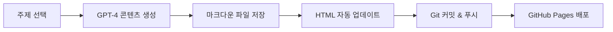
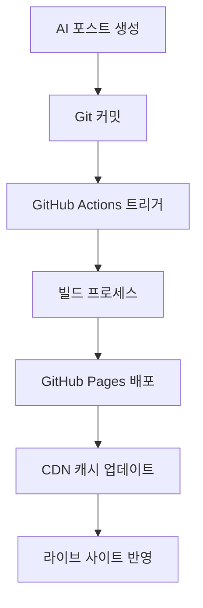

# 🤖 AI 인사이트 블로그

> 인공지능의 미래를 탐구하는 자동화된 전문 블로그

[](https://tonyhwang1004.github.io/ai-insight-blog)
[](#-ai-자동-포스팅-시스템)
[](LICENSE)
[](https://github.com/tonyhwang1004/ai-insight-blog/stargazers)

---

## 📋 프로젝트 소개

**AI 인사이트**는 최신 인공지능 기술 동향과 트렌드를 다루는 **완전 자동화된 전문 블로그**입니다. 

**OpenAI GPT를 활용한 자동 포스팅 시스템**으로 매일 고품질의 AI 관련 콘텐츠를 생성하고, GitHub Pages를 통해 자동으로 웹사이트에 게시됩니다.

### 🎯 주요 목표
- 최신 AI 기술 동향 실시간 분석
- 실무진을 위한 실용적인 AI 활용 가이드 제공  
- AI 도구와 서비스 심층 리뷰
- AI 투자 및 시장 분석 인사이트

---

## ✨ 주요 특징

### 🤖 **AI 자동 포스팅 시스템**
- **OpenAI GPT-4** 기반 고품질 한국어 콘텐츠 자동 생성
- **8가지 AI 주제** 자동 선택 및 로테이션
- **매일 정기 포스팅** (한국시간 오후 6시)
- **2000자 이상** 전문적인 심층 분석

### 🎨 **모던 웹 디자인**
- **반응형 디자인** - 모든 디바이스 최적화
- **다크/라이트 그라디언트** 현대적 UI/UX
- **빠른 로딩 속도** - 정적 사이트 최적화
- **접근성 준수** - WCAG 2.1 가이드라인

### 💰 **수익화 준비**
- **Google AdSense** 통합 광고 시스템
- **전략적 광고 배치** (헤더, 사이드바, 본문 중간)
- **SEO 최적화** - 검색엔진 상위 노출
- **소셜 미디어 최적화** - 바이럴 마케팅 준비

### 🔧 **완전 자동화**
- **GitHub Actions** 기반 CI/CD 파이프라인
- **자동 의존성 관리** - 패키지 자동 설치
- **오류 처리 및 로깅** - 안정적인 운영
- **Git 자동 커밋** - 변경사항 추적

---

## 🛠️ 기술 스택

### **Frontend**
```
HTML5          시멘틱 마크업 및 구조화
CSS3           모던 스타일링 (Grid, Flexbox, Variables)
JavaScript     인터랙티브 기능 및 동적 컨텐츠
```

### **Backend & Automation**
```
Python 3.10+   자동 포스팅 스크립트
OpenAI API     GPT-4 기반 콘텐츠 생성
GitHub Actions CI/CD 파이프라인 자동화
GitHub Pages   정적 사이트 호스팅
```

### **핵심 라이브러리**
```python
openai>=1.0.0           # OpenAI GPT API 클라이언트
requests>=2.31.0        # HTTP 요청 처리
beautifulsoup4>=4.12.0  # HTML 파싱 및 조작
schedule>=1.2.0         # 작업 스케줄링
```

### **개발 도구**
```
GitHub Actions    자동화 워크플로우
GitHub Secrets    안전한 API 키 관리
GitHub Pages      무료 웹 호스팅
Git               버전 관리 시스템
```

---

## 🏗️ 프로젝트 구조

```
ai-insight-blog/
├── 📁 .github/
│   └── 📁 workflows/
│       └── 📄 auto-post.yml         # GitHub Actions 워크플로우
├── 📁 scripts/
│   ├── 📄 auto_blogger.py          # 🤖 AI 자동 포스팅 스크립트
│   └── 📄 setup.sh                 # 🔧 환경 설정 스크립트
├── 📁 posts/                       # 📝 생성된 블로그 포스트
│   ├── 📄 20250611_140153_ChatGPT-5_출시_예정일.md
│   ├── 📄 20250611_140328_AI_코딩_어시스턴트_비교.md
│   └── 📄 ...
├── 📁 logs/                        # 📊 시스템 로그
├── 📄 index.html                   # 🏠 메인 페이지
├── 📄 _config.yml                  # ⚙️ GitHub Pages 설정
├── 📄 .env.example                 # 🔐 환경변수 예제
└── 📄 README.md                    # 📚 프로젝트 문서
```

---

## ⚡ 빠른 시작

### 1️⃣ **저장소 클론**
```bash
git clone https://github.com/tonyhwang1004/ai-insight-blog.git
cd ai-insight-blog
```

### 2️⃣ **환경 설정**
```bash
# 환경 설정 스크립트 실행 (권장)
chmod +x scripts/setup.sh
./scripts/setup.sh

# 또는 수동 설정
pip install openai requests beautifulsoup4
```

### 3️⃣ **API 키 설정**
```bash
# 방법 1: 환경변수 설정
export OPENAI_API_KEY="sk-your-openai-api-key-here"

# 방법 2: .env 파일 생성
echo "OPENAI_API_KEY=sk-your-openai-api-key-here" > .env
```

### 4️⃣ **자동 포스팅 테스트**
```bash
cd scripts
python3 auto_blogger.py
```

### 5️⃣ **로컬 서버 실행**
```bash
# Python 내장 서버
python3 -m http.server 8000

# 브라우저에서 확인
open http://localhost:8000
```

---

## 🤖 AI 자동 포스팅 시스템

### **🎯 지원 주제 (자동 선택)**
1. **ChatGPT 최신 업데이트** - OpenAI 동향 분석
2. **AI 코딩 어시스턴트 비교** - 개발도구 리뷰
3. **생성형 AI 활용사례** - 실무 적용 가이드
4. **머신러닝 실전 가이드** - 기술 튜토리얼
5. **AI 윤리와 규제** - 정책 및 사회적 이슈
6. **AI 스타트업 투자 트렌드** - 시장 분석
7. **자연어 처리 최신 동향** - 기술 연구 동향
8. **AI 비즈니스 자동화** - 업무 효율화 사례

### **📝 포스트 생성 프로세스**


### **⏰ 자동 스케줄링**
- **정기 실행**: 매일 오전 9시 UTC (한국시간 오후 6시)
- **수동 실행**: GitHub Actions에서 "Run workflow" 버튼
- **조건부 실행**: 새 콘텐츠 생성시에만 커밋

---

## 🎨 커스터마이징 가이드

### **🎨 테마 색상 변경**
```css
/* index.html의 :root 섹션에서 수정 */
:root {
    --primary-color: #2563eb;     /* 메인 브랜드 색상 */
    --secondary-color: #1e40af;   /* 보조 색상 */
    --accent-color: #f59e0b;      /* 강조 색상 */
    --text-primary: #1f2937;      /* 본문 텍스트 */
    --bg-primary: #ffffff;        /* 배경 색상 */
}
```

### **📝 블로그 정보 수정**
```html
<!-- index.html에서 수정 -->
<title>당신의 블로그 제목</title>
<meta name="description" content="블로그 설명">
<meta name="keywords" content="키워드1, 키워드2">
```

### **🤖 AI 주제 추가**
```python
# scripts/auto_blogger.py의 get_ai_topics() 함수에서
topics = [
    {
        "title": "새로운 AI 주제",
        "category": "카테고리명",
        "keywords": ["키워드1", "키워드2"]
    }
    # ... 기존 주제들
]
```

---

## 💰 수익화 설정

### **1. Google AdSense 연동**
```html
<!-- index.html <head>에 AdSense 코드 추가 -->
<script async src="https://pagead2.googlesyndication.com/pagead/js/adsbygoogle.js?client=ca-pub-YOUR_PUBLISHER_ID"
     crossorigin="anonymous"></script>
```

### **2. 광고 배치 전략**
- **헤더 배너**: 728x90 (높은 노출률)
- **사이드바**: 300x600 (지속적 노출)
- **본문 중간**: 300x250 (높은 클릭률)
- **모바일 최적화**: 반응형 광고 단위

### **3. 수익 최적화 팁**
- **고품질 콘텐츠** 지속 생성
- **SEO 최적화**로 자연 유입 증대
- **소셜 미디어** 공유 확산
- **로딩 속도** 최적화

---

## 📊 SEO 최적화

### **🎯 이미 적용된 SEO 기능**
✅ **메타 태그 최적화** - 제목, 설명, 키워드  
✅ **Open Graph 태그** - 소셜 미디어 최적화  
✅ **시멘틱 HTML** - 검색엔진 친화적 구조  
✅ **구조화 데이터** - JSON-LD 스키마  
✅ **반응형 디자인** - 모바일 SEO  
✅ **빠른 로딩** - Core Web Vitals 최적화

### **📈 SEO 성능 향상 방법**
1. **Google Search Console** 등록
2. **Google Analytics** 연동
3. **사이트맵 자동 생성**
4. **내부 링크 최적화**
5. **이미지 최적화** (WebP, Alt 태그)

---

## 🔧 고급 설정

### **🚀 GitHub Actions 환경 설정**

#### **Secrets 설정 (필수)**
```
Repository Settings → Secrets and variables → Actions

OPENAI_API_KEY = sk-your-openai-api-key-here
```

#### **권한 설정**
```
Repository Settings → Actions → General → Workflow permissions
☑️ Read and write permissions
☑️ Allow GitHub Actions to create and approve pull requests
```

### **🔒 보안 설정**
- **API 키 보호**: GitHub Secrets 사용
- **브랜치 보호**: main 브랜치 보호 규칙
- **의존성 스캔**: Dependabot 활성화

---

## 📈 성능 모니터링

### **📊 추천 분석 도구**
- **Google Analytics 4** - 사용자 행동 분석
- **Google Search Console** - 검색 성능 모니터링
- **PageSpeed Insights** - 페이지 속도 측정
- **GTmetrix** - 종합 성능 분석

### **🎯 주요 KPI 지표**
- **DAU (일간 활성 사용자)**
- **페이지 뷰수**
- **평균 체류 시간**
- **이탈률**
- **검색 노출 수**
- **AdSense 수익**

---

## 🔄 배포 및 운영

### **🚀 자동 배포 프로세스**


### **📋 운영 체크리스트**
- [ ] **일일**: 포스트 생성 확인
- [ ] **주간**: 성능 지표 리뷰
- [ ] **월간**: SEO 순위 분석
- [ ] **분기**: 수익 최적화 전략 수립

---

## 🚨 문제 해결

### **❌ 자주 발생하는 오류**

#### **1. API 키 오류**
```bash
# 확인 방법
echo $OPENAI_API_KEY

# 해결 방법
export OPENAI_API_KEY="sk-your-key-here"
```

#### **2. 권한 오류 (403)**
```
Settings → Actions → General → Workflow permissions
"Read and write permissions" 선택
```

#### **3. 의존성 설치 실패**
```bash
# Python 버전 확인
python3 --version

# pip 업그레이드
python3 -m pip install --upgrade pip

# 패키지 재설치
pip install -r requirements.txt
```

### **🔍 디버깅 방법**
1. **Actions 탭**에서 워크플로우 로그 확인
2. **logs/** 폴더의 상세 로그 분석
3. **로컬 환경**에서 스크립트 직접 실행

---

## 🤝 기여 가이드

### **💡 기여 방법**
1. **Fork** 프로젝트
2. **Feature Branch** 생성 (`git checkout -b feature/amazing-feature`)
3. **변경사항 커밋** (`git commit -m 'Add amazing feature'`)
4. **브랜치 푸시** (`git push origin feature/amazing-feature`)
5. **Pull Request** 생성

### **📝 기여 영역**
- 🤖 **AI 모델 최적화** - 더 나은 콘텐츠 생성
- 🎨 **UI/UX 개선** - 사용자 경험 향상
- 🔧 **성능 최적화** - 로딩 속도 개선
- 📊 **분석 기능** - 데이터 시각화
- 🌐 **다국어 지원** - 글로벌 확장

---

## 🗓️ 로드맵

### **📅 단기 목표 (1개월)**
- [ ] **다크 모드** 추가
- [ ] **검색 기능** 구현
- [ ] **댓글 시스템** 연동 (Utterances)
- [ ] **뉴스레터** 구독 기능

### **🎯 중기 목표 (3개월)**
- [ ] **AI 이미지 생성** 연동 (DALL-E)
- [ ] **다국어 지원** (영어, 일본어)
- [ ] **PWA** 변환
- [ ] **개인화 추천** 시스템

### **🚀 장기 목표 (6개월)**
- [ ] **AI 챗봇** 통합
- [ ] **실시간 트렌드** 분석
- [ ] **커뮤니티 기능** 추가
- [ ] **모바일 앱** 개발

---

## 📞 연락처 및 지원

### **📧 연락처**
- **이메일**: contact@ai-insight.blog
- **웹사이트**: https://tonyhwang1004.github.io/ai-insight-blog
- **GitHub**: [@tonyhwang1004](https://github.com/tonyhwang1004)

### **💬 커뮤니티**
- **Issues**: [GitHub Issues](https://github.com/tonyhwang1004/ai-insight-blog/issues)
- **Discussions**: [GitHub Discussions](https://github.com/tonyhwang1004/ai-insight-blog/discussions)

### **📚 문서 및 자료**
- **OpenAI API**: https://platform.openai.com/docs
- **GitHub Pages**: https://docs.github.com/pages
- **GitHub Actions**: https://docs.github.com/actions

---

## 📄 라이선스

이 프로젝트는 **MIT 라이선스** 하에 배포됩니다. 자세한 내용은 [LICENSE](LICENSE) 파일을 참조하세요.

```
MIT License

Copyright (c) 2025 AI Insight Blog

Permission is hereby granted, free of charge, to any person obtaining a copy
of this software and associated documentation files (the "Software"), to deal
in the Software without restriction...
```

---

## 🙏 감사의 말

### **🔧 오픈소스 도구**
- **[OpenAI](https://openai.com)** - GPT-4 API 제공
- **[GitHub](https://github.com)** - 무료 호스팅 및 CI/CD
- **[Python](https://python.org)** - 강력한 프로그래밍 언어

### **🎨 디자인 영감**
- **[Tailwind CSS](https://tailwindcss.com)** - 현대적 CSS 프레임워크
- **[Google Fonts](https://fonts.google.com)** - 웹폰트 제공

### **👥 커뮤니티**
- **AI/ML 커뮤니티** - 지속적인 영감과 아이디어
- **오픈소스 기여자들** - 코드 리뷰 및 피드백

---

## 🌟 별점 및 공유

이 프로젝트가 도움이 되었다면 **⭐ 별점**을 눌러주세요!

[](https://github.com/tonyhwang1004/ai-insight-blog/stargazers)

### **📱 소셜 미디어 공유**
- [Twitter에서 공유](https://twitter.com/intent/tweet?text=🤖%20AI%20자동%20블로그%20시스템을%20확인해보세요!&url=https://github.com/tonyhwang1004/ai-insight-blog)
- [LinkedIn에서 공유](https://www.linkedin.com/sharing/share-offsite/?url=https://github.com/tonyhwang1004/ai-insight-blog)

---

<div align="center">

### 🚀 **AI와 함께하는 미래형 블로깅** 🚀

**Made with ❤️ by AI Insight Blog Team**

[🌐 라이브 사이트 방문](https://tonyhwang1004.github.io/ai-insight-blog) • [⭐ 별점 주기](https://github.com/tonyhwang1004/ai-insight-blog) • [🤝 기여하기](https://github.com/tonyhwang1004/ai-insight-blog/contributing)

</div>
